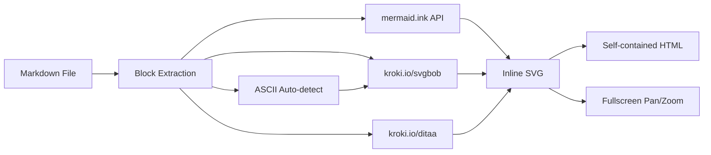

# mdview — Architecture

## What

Lightweight markdown + multi-diagram viewer. Renders to interactive HTML
with fullscreen pan/zoom. Zero local dependencies — HTTP APIs only.

## Why

AI coding tools (Claude Code, Cursor, Copilot CLI) generate markdown specs,
architecture docs, and epistemic plans with embedded diagrams. There's no
lightweight tool to render these as interactive documents.

The gap:
- **Obsidian/Typora** — heavy desktop apps, not diagram-focused
- **mermaid-cli** — mermaid only, no markdown context, no interactivity
- **VS Code preview** — editor-bound, no standalone use, no mobile
- **GitHub rendering** — no pan/zoom, no ASCII art, no interactivity

mdview fills this: `pip install mdview && mdview SPEC.md`

## Diagram Types



| Type | Detection | Renderer | API |
|------|-----------|----------|-----|
| Mermaid | ````mermaid` fence | mermaid.ink | GET with base64 |
| SVGBob | ````svgbob` fence | kroki.io | POST with source |
| Ditaa | ````ditaa` fence | kroki.io | POST with source |
| ASCII auto | Heuristic on unmarked blocks | kroki.io/svgbob | POST with source |

### ASCII Auto-Detection Heuristic

Unmarked code blocks are classified as ASCII art when:
1. 3+ lines
2. Not a file tree (├── pattern at <30% of lines)
3. Not code (common keywords at <20% of lines)
4. Has structural borders AND >25% box/arrow chars, OR >45% box/arrow chars alone

### SVGBob Pre-Processing

Unicode box-drawing → ASCII (`┌→+`, `─→-`, `│→|`) for predictable rendering.
Parentheses `()` → brackets `[]` in text regions (svgbob interprets them as arcs).
Unicode arrows (→←▼▲) kept as-is — svgbob renders them as text.

## Architecture

```
┌─────────────────────────────────────────────┐
│ CLI Layer                                   │
│   mdview FILE.md [--terminal | --html]      │
│   mdview serve FILE.md --watch              │
├─────────────────────────────────────────────┤
│ Renderer                                    │
│   Markdown → HTML conversion                │
│   Diagram block replacement with inline SVG │
│   Lightbox overlay generation               │
│   Table of contents                         │
├─────────────────────────────────────────────┤
│ Diagram Engine                              │
│   Block extraction + classification         │
│   ASCII art heuristic                       │
│   SVGBob pre-processing                     │
│   HTTP rendering via mermaid.ink + kroki.io │
├─────────────────────────────────────────────┤
│ Output Modes                                │
│   HTML: Self-contained, dark/light theme    │
│   Terminal: rich markdown + diagram panels  │
│   Server: HTTP + WebSocket live reload      │
└─────────────────────────────────────────────┘
```

## File Structure

```
mdview/
├── src/mdview/
│   ├── __init__.py      # Package exports
│   ├── cli.py           # CLI entry point
│   ├── diagrams.py      # Diagram extraction + rendering
│   ├── renderer.py      # Markdown → HTML/terminal
│   └── server.py        # Live reload server (planned)
├── tests/
│   ├── test_diagrams.py
│   └── test_renderer.py
├── ARCHITECTURE.md      # This file
├── pyproject.toml
└── LICENSE              # MIT
```

## Roadmap

### v0.1 — Core (current)
- [x] Mermaid diagram rendering via mermaid.ink
- [x] ASCII art → SVG via kroki.io/svgbob
- [x] Ditaa support via kroki.io
- [x] Auto-detection of ASCII art in unmarked code blocks
- [x] SVGBob pre-processing (Unicode box-drawing, paren escaping)
- [x] Self-contained HTML output with dark/light theme
- [x] Fullscreen lightbox with pan/zoom (mouse + touch + keyboard)
- [x] Table of contents from headings
- [x] Terminal rendering via rich
- [x] CLI: `mdview FILE.md`

### v0.2 — Live Reload
- [ ] `mdview serve FILE.md --watch` — local HTTP server
- [ ] inotify/fswatch file watcher
- [ ] WebSocket push for live reload
- [ ] Auto-open browser on start

### v0.3 — PWA
- [ ] Service worker for offline support
- [ ] PWA manifest for installable app
- [ ] Mobile-optimized touch controls
- [ ] Responsive layout

### v0.4 — Distribution
- [ ] PyPI package: `pip install mdview`
- [ ] Debian package (.deb)
- [ ] Tauri wrapper for native desktop app
- [ ] Homebrew formula

### Future
- [ ] Diagram editing (live mermaid editor)
- [ ] Export to PDF
- [ ] Multi-file project view
- [ ] Plugin system for custom diagram types

## Configuration

Environment variables:
- `MDVIEW_DIAGRAM_SERVICE` — Override mermaid/kroki service URL (for local instances)

No config files needed. Zero configuration by default.

## Design Principles

1. **Zero dependencies for core** — stdlib only, optional extras for rich/markdown
2. **Self-contained output** — single HTML file, no external resources needed
3. **API-first rendering** — mermaid.ink + kroki.io, no local diagram tools
4. **Mobile-friendly** — touch pan/zoom, PWA-capable, responsive
5. **AI workflow native** — designed for AI-generated specs and plans
